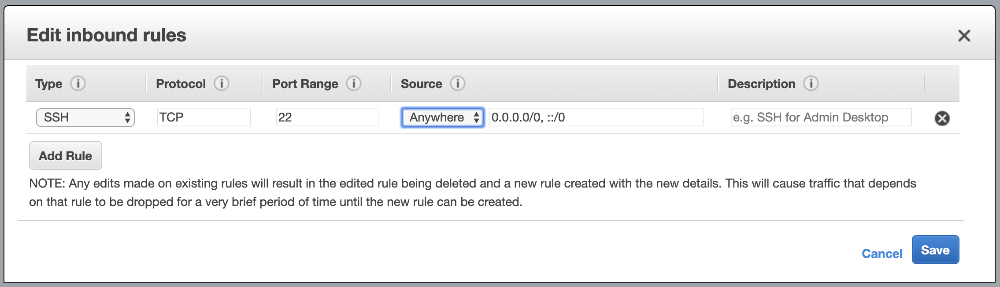

If you followed my [blog post](https://inssein.com/cloud-based-ide/), you now have a fully functioning cloud based integrated development environment. This is good enough to start out with, but lets take it to the next level.

In this blog post, I will show you how you can use [Visual Studio Code](https://code.visualstudio.com/) and connect it to your AWS Cloud 9 development environment. This allows you to not have to setup anything on your local machine, except for having to install Visual Studio Code.

Visual Studio Code is also the suggested IDE if you are following The Odin Project:

> VSCode is an excellent free code editor. It has outstanding add-on support and great Git integration. VSCode is the most popular code editor among Odin’s students and moderators, so support is easy to find in the community.

## Pre-requisites

1. Download and install [Visual Studio Code](https://code.visualstudio.com/).
2. Add [Remote Development Extension Pack](https://marketplace.visualstudio.com/items?itemName=ms-vscode-remote.vscode-remote-extensionpack) to Visual Studio Code.

## Connect to SSH

Since your AWS Cloud 9 instance is just a regular AWS EC2 instance, we can customize it so that we can connect to it from anywhere in the world.

First step is that we have to allow SSH connections from the outside. To do this:

1. Go to the [Amazon EC2 Console](https://us-west-2.console.aws.amazon.com/ec2/v2/home?region=us-west-2#Instances:sort=instanceId).
2. You should only have one instance if you just created this account, and it should be auto selected. Otherwise, click on the Cloud 9 instance.
3. In the description tab at the bottom, there should be a row for "Security groups", with one security group in that row. Click on the name of the security group.
4. Click in the "Inbound" tab at the bottom.
5. By default, I had two rows already allowing SSH connections to what looks like an internal Amazon IP range so that Cloud 9 can connect to this machine via SSH. Since we want to be able to connect from anywhere, click on "Edit".
6. I delete my second row, and in my first row, I have set the source to "Anywhere". It should look like this:
   

## Allow Password Based Authentication

We are going to setup simple password based authentication so we can connect to the EC2 instance. This is _not_ the way I'd recommend to access production based machines, as you should really be setting up access via [Public key authentication](https://en.wikipedia.org/wiki/Public-key_cryptography). However, I want to keep this as simple as possible.

1. We need to setup a password for our account. In the terminal in Cloud 9, type `sudo passwd ubuntu`, and then type in a password of choice.
2. We need to now enable password based authentication. If you already know how to use a terminal, edit `/etc/ssh/sshd_config` and set `PasswordAuthentication` to `yes`. If you are not familiar, follow these steps:
   - Type in `sudo vim /etc/ssh/sshd_config` in the terminal.
   - Type in `/PasswordAuth` to find the text, and then hit enter.
   - You are now on the line that needs to be changed. Press `i` to get into insert mode.
   - Go to the end of the line, replace `no` with `yes`.
   - To exit insert mode, press escape.
   - Type `:wq` into the console and press enter (this writes the file, and exits).
   - I've hopefully given you your first taste of `vim`. To learn more, check out [OpenVim](https://www.openvim.com/).
3. Type `sudo service ssh restart` to restart the SSH service.

## Connect to Your Cloud 9 Instance

Now the EC2 instance is ready to be connected to via Visual Studio Code.

1. We need to get the public hostname for our EC2 instance. To do this, lets go back to [EC2 AWS Console](https://us-west-2.console.aws.amazon.com/ec2/v2/home?region=us-west-2#Instances:sort=instanceId), and select our Cloud 9 instance. In the description tab, there will be a Public DNS row. Let's copy this address.
2. Open visual studio code.
3. On the bottom left, there is a green button that shows up once you have installed the Remote Development Extension Pack. Let's click on this.
4. Use the arrows keys to select "Remote-SSH: Connect to Host...".
5. In the next prompt, select "Add New SSH Hosts...".
6. In the next dialog box, enter `ssh ubuntu@` and then paste what we copied in step 1.
7. In the next dialog box, pick a file to save your SSH config. I am on a Mac, so I selected my local ssh config which is `/Users/inssein/.ssh/config`.
8. A prompt will show on the bottom right saying that the host has been added. In this prompt, click on the "Connect" button.
9. A new Visual Studio Code window will open, and it will connect you to the EC2 instance. Since we are using password based auth, it will ask you for the password every time.

## Hello World

Now that you are connect to the Cloud 9 environment via Visual Studio Code, I am going to show you two small examples.

First, let's edit the `index.html` file we created in the first blog post.

1. Click on the "Explorer" icon, which on the top left.
2. Click on the "Open Folder" button.
3. In the next dialog box, type in `environment`, so that it reads `/home/ubuntu/environment` (environment is the folder Cloud 9 uses).
4. Hit enter and Visual Studio Code should reload with the environment folder open.
5. In the explorer, the `environment` folder should be open. Lets select the `index.html` file, and change `<h1>Hello World</h1>` to `<h1>Hello Visual Studio Code</h1>`, and then save the file.
6. If you still have the separate browser window open from the previous blog post, reload it, otherwise, if you go back into Cloud 9 and preview the file, you should see your new changes in the browser.

The second quick example is to show you that you can use the terminal inside Visual Studio Code just like you could with AWS Cloud 9. To try this, select `Terminal` in the top file menu, and then select `New Terminal`.

## What's Next

You now have a local IDE hooked up to a remote development environment, without installing anything on your local machine.

The one annoying thing with this setup is that every time you start it, it will ask you for your password. As I mentioned before, my goal was to get your playing around with a terminal and the IDE first, and then if you are still enjoying it, I recommend you setup key based authentication. Maybe this will be my next blog post.
